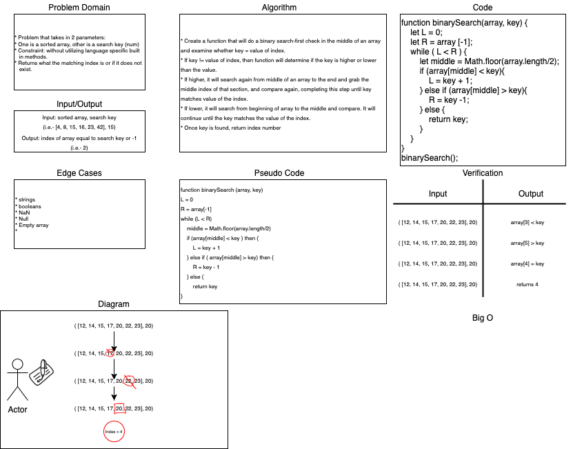

# Array Binary Search

## Challenge

+ Problem that takes in 2 parameters: One is a sorted array, other is a search key (num)

+ Constraint: Create function without using any language specific built in methods

+ Returns what the matching index is or if it does not exist.

+ Edge cases: string, booleans, NaN, Null, and empty array.

## Code challenge/Pair programming

+ Stacy Burris, Tina Myers

## Approach & Efficiency

+ Input: sorted array, search key (i.e. [4, 8, 15, 16, 23, 42], 15)
+ Output: Index of array equal to search key or -1 
(i.e. -2)

## Solution

+ 