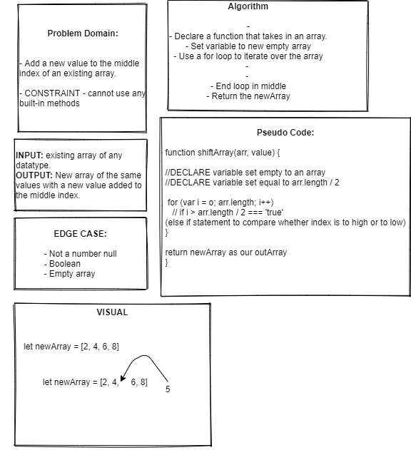

# Challenge Summary

+ Take in an array and add a new value to the middle of the array.

## Challenge Description

+ Add a new value to the middle index of an existing array.

+ CONSTRAINT - cannot use any built-in methods

Edge Case:
  + INPUT: Existing array of any datatype.
  + OUTPUT: New array of the same values with a new value added to the middle index.

## Approach & Efficiency

+ Declare a variable set to an empty array
+ Declare a variable and set equal to arr.length / 2
+ Write a for loop that iterates through original array and then makes comparisons to determine if the index is greater than less than or equal to the center.
+ If less then = null 
+ If more then = null
+ If equal to insert into array
+ Return newArray

## Solution

+ 