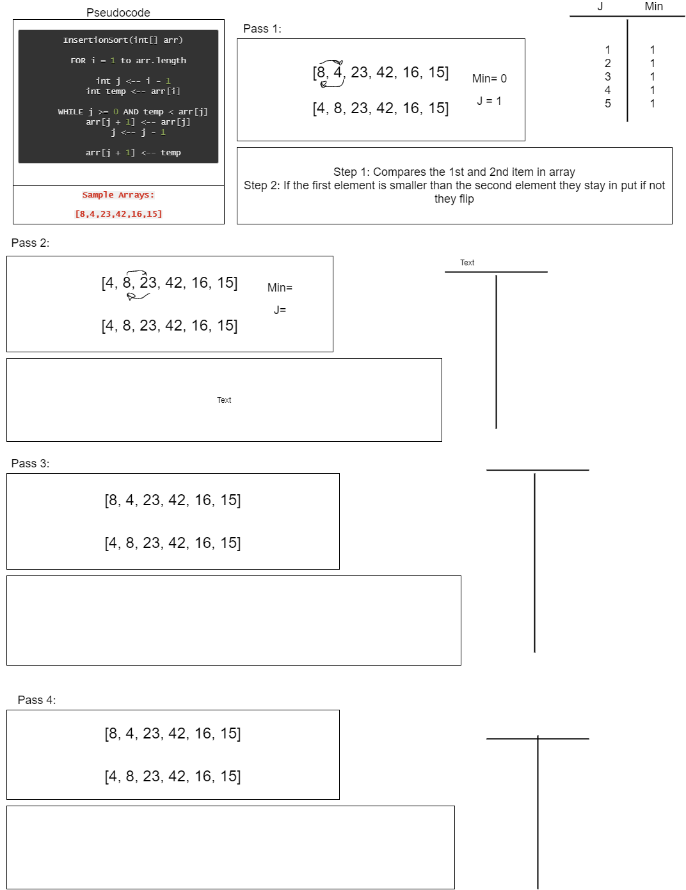

# Code Challenge: Class 26 - Insertion Sort

## Contributors and Collaborators

+ Tina Myers
+ Sara Strasner

## Challenge Summary

+ For this challenge through each interaction you compare 2 items in the array at a time. If the first element is smaller that the second element, it would stay the same. Else, they flip. Continue through the whole array until it is sorted from smallest to largest value.

## Challenge Description

+ Pseudocode:
```
  InsertionSort(int[] arr)
  
    FOR i = 1 to arr.length
    
      int j <-- i - 1
      int temp <-- arr[i]
      
      WHILE j >= 0 AND temp < arr[j]
        arr[j + 1] <-- arr[j]
        j <-- j - 1
        
      arr[j + 1] <-- temp

  Sample Array: [8,4,23,42,16,15]
```

## Efficiency

+ Time: )(n^2) - Algorithm is comparison 
+ Space:O(1) - No additional space is being created


## Solution

```
let insertionSort = (int, arr) => {
  for (let i = 1; i < arr.length; i++) {
    let j = i - 1;
    let temp = arr[i];
    while (j >= 0 && temp < arr[j]) {
      arr[j + 1] = arr[j];
      j = j - 1;
    }
    arr[j + 1] = temp;
  }
  return arr;
};
```

+ 