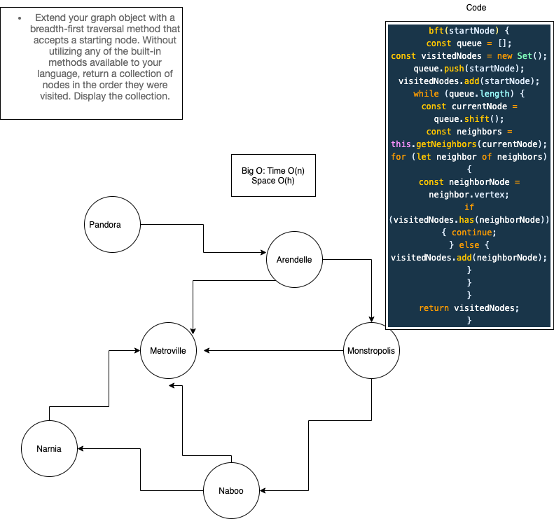

# BreadthFirst

## Challenge

+ Implement a breadth-first traversal on a graph.
+ Extend your graph object with a breadth-first traversal method that accepts a starting node. Without utilizing any of the built-in methods available to your language, return a collection of nodes in the order they were visited. Display the collection.

## Author: Stacy Burris

## Approach & Efficiency

+ breadthFirst - BigO(n)

output: [Pandora, Arendelle, Metroville, Monstroplolis, Narnia, Naboo]

### UML

+ 