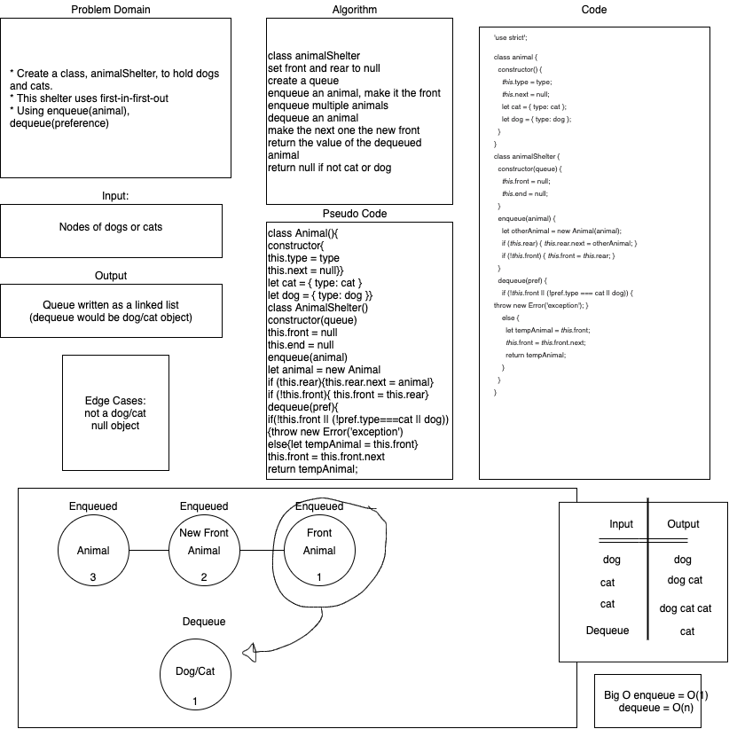

# Fifo Animal Shelter

## Authors

+ Stacy Burris, Tina Myers, Sara Strasner

## Challenge

+ Create a class called AnimalShelter that holds dogs and cats. With a first in, first-out approach

## API, Approach & Efficiency

+ enqueue(animal) - O(1) - Adds animals to the shelter either cats or dogs
+ dequeue(pref) - O(n) - Returns either dogs or cats and if neither returns null

### Whiteboard

+ 
