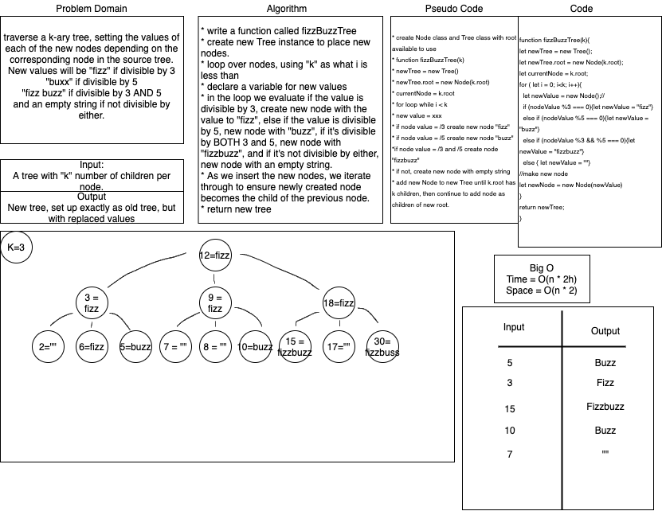

# FizzBuzzTree

## Challenge Summary

+ Conduct “FizzBuzz” on a k-ary tree while traversing through it to create a new tree.

## Challenge Description

+ Traverse  k-ary tree, setting the values of each of the new nodes depending on the corresponding node in the source tree. New values will be "fizz" if divisible by 3 "buzz" if divisible by 5 and "fizzBuzz" if divisible by 3 and 5. Else if divisible by neither return empty string. Return new tree.

## Approach & Efficiency

+ Time = O(n *2h)
+ Space = O(n * 2)

## Solution

 

### Contributors and Collaborators

+ Tina Myers and Sara Strasner