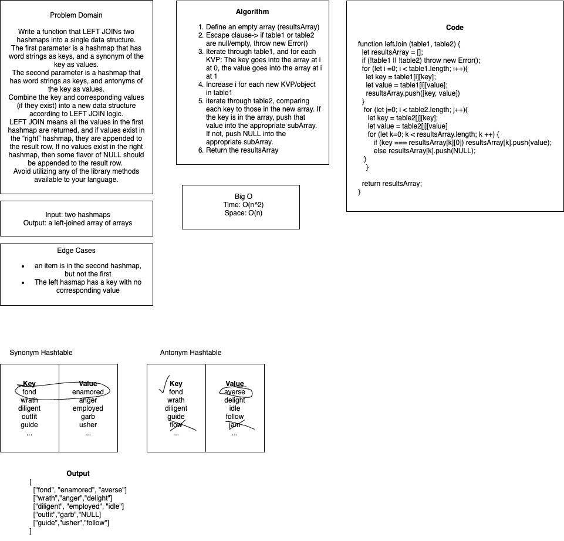

# Hashmap LEFT JOIN

+ Implement a simplified LEFT JOIN for 2 Hashmaps.

## Challenge

+ Write a function that LEFT JOINs two hashmaps into a single data structure.
The first parameter is a hashmap that has word strings as keys, and a synonym of the key as values.
The second parameter is a hashmap that has word strings as keys, and antonyms of the key as values.
Combine the key and corresponding values (if they exist) into a new data structure according to LEFT JOIN logic.
+ Without build-in methods

+ **Left Join**
  + The SQL LEFT JOIN returns all rows from the left table, even if there are no matches in the right table. This means that if the ON clause matches 0 (zero) records in the right table; the join will still return a row in the result, but with NULL in each column from the right table.
  + This means that a left join returns all the values from the left table, plus matched values from the right table or NULL in case of no matching join predicate.

## Approach & Efficiency

+ BigO = Time: o(n^2) & Space: o(n)

## Solution

+ 