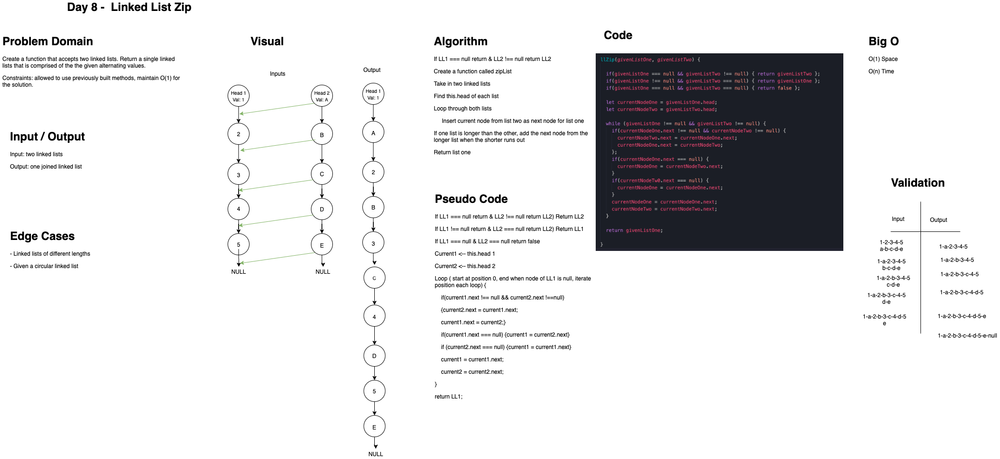

# Code Challenge: Class 08

+ Zip two linked lists

### Contributors & Collaborators

+ Simon Panek and Ricardo Barcenas

### Challenge

+ Create a function called zipLists that accepts two linked lists. Return a single linked list that is comprised of the given alternating values
+ CONSTRAINTS - allowed to use previous and built in methods.
+ Input: two linked lists
+ Output: one joined linked list

## API & Efficiency

`zipLists(list1, list2)`

+ **BigO** - O(1) Space & o(n) time

+ 