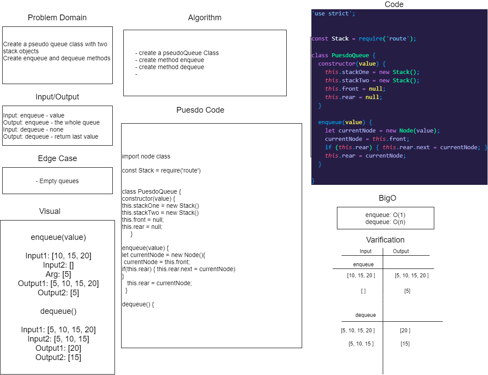

# QueuesWithStacks

## Authors

+ Stacy Burris, Tina Myers, Sara Strasner

## Challenge

+ Create a pseudo queue class with two stack objects
+ Create enqueue and dequeue methods

## API, Approach & Efficiency

+ enqueue() - O(1)
+ dequeue() - O(n)

### Whiteboard

+ 
