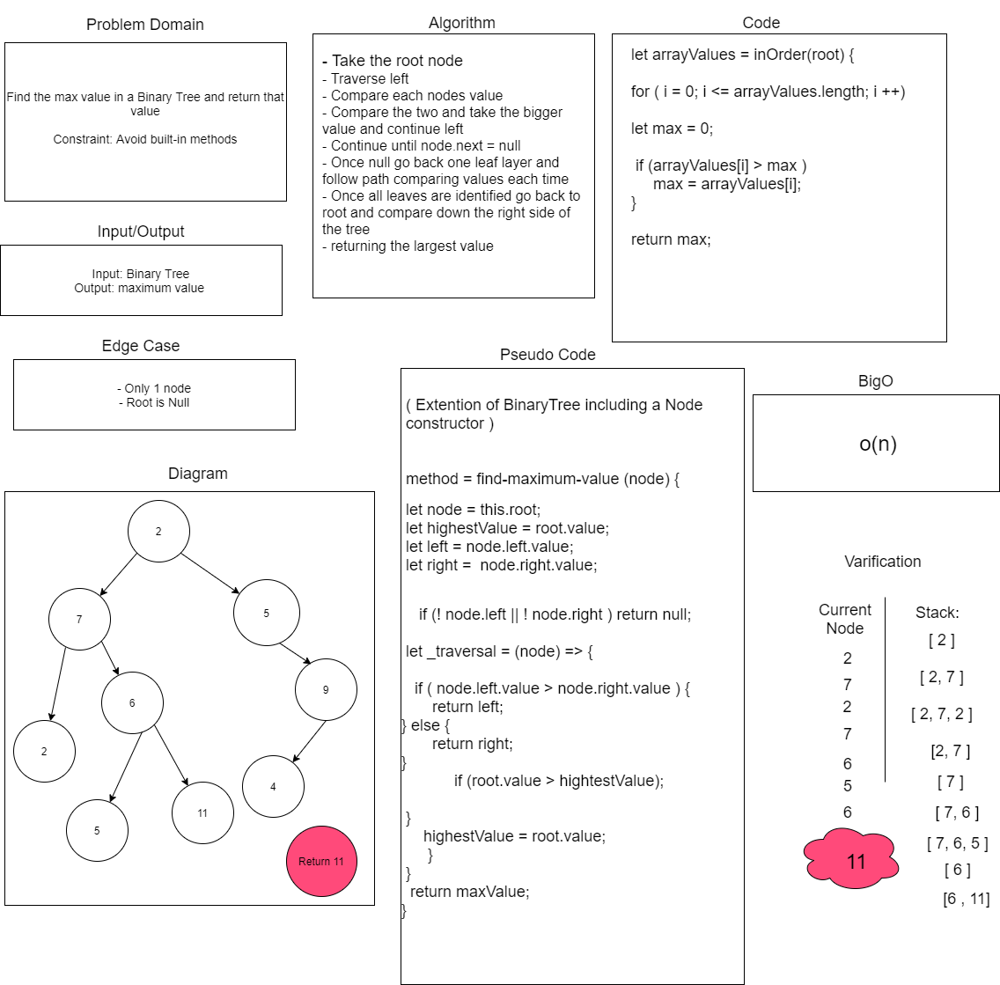
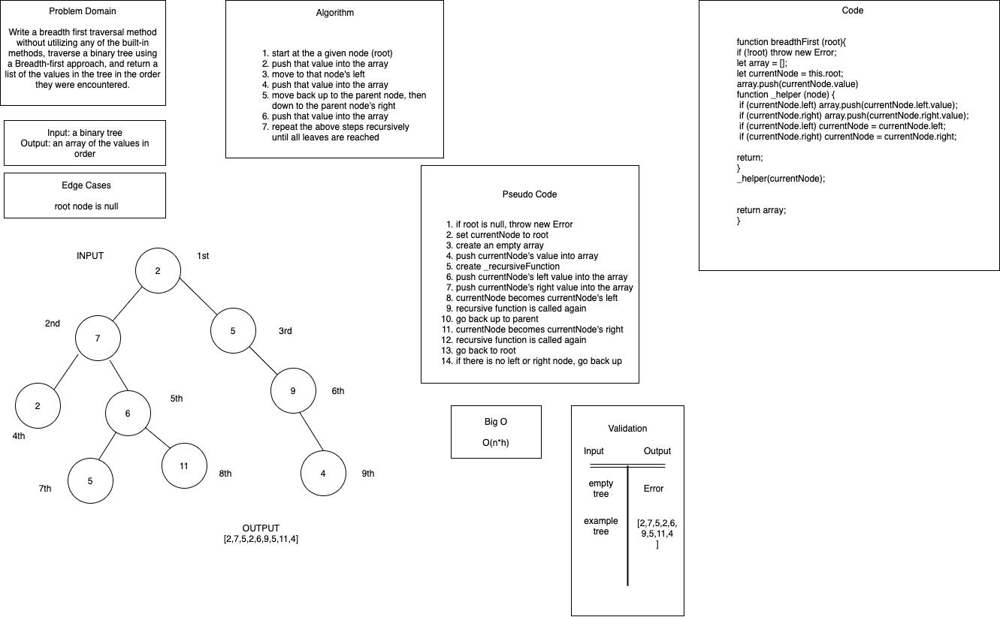

# Trees

+ Create a Node class, BinaryTree class and BinarySearchTree class

## Challenge

+ Create a Node class that has properties for the value stored in the node, the left child node, and the right child node.
+ Create a BinaryTree class and define a method for each of the depth first traversals called preOrder, inOrder and postOrder which returns an array of the values ordered appropriately.
+ Create a BinarySearchTree class that defines a method named add that accepts a value, and adds a new node with the value in the correct location in the binary search tree. Also define a method named contains that accepts a value, and returns a boolean indicating whether the value is in the tree at least once.

## Approach & Efficiency

+ preOrder = O(n)
+ inOrder = O(n)
+ postOrder = O(n)
+ add = O(h)
+ contains = O(log n)

## API

**BinaryTree**

+ preOrder = root, left, right 
+ inOrder = left, root, right 
+ postOrder = left, right, root

**BinarySearchtree**

+ add = adds a node with a given value to the correct location in a binary search tree 
+ contains = returns a boolean which will determine whether a searched value is located in a binary search tree 

### Resources

+ [Binary Search trees](https://www.youtube.com/watch?v=9Jry5-82I68)
+ [Binary Trees](https://www.youtube.com/watch?v=FcaTY3_EvZQ&feature=youtu.be)
+ [Binary Trees and Recursion](https://www.youtube.com/watch?v=MhYw0X6BfxM&feature=youtu.be)
+ [Tree Traversal via JavaScript](https://www.digitalocean.com/community/tutorials/js-tree-traversal)
+ [Stack overflow](https://stackoverflow.com/questions/62474030/binary-tree-code-cannot-read-property-data-of-undefined)

# Code Challenge: Class 16

## Find the Maximum Value in a Binary Tree

## Challenge

+ Find the max value in a Binary Tree and return that value
  + Constraint: Without using built-in methods

### Approach & Efficiency

+ findMaximumValue() = O(n)

### Contributors and Collaborators

+ Tina Myers and Sara Strasner

+ 

# Code Challenge: Class 17

## Breadth-first Traversal

## Challenge

+ Write a breadth first traversal method which takes a Binary Tree as its unique input. Without utilizing any of the built-in methods. Traverse the input tree using a Breadth-first approach, and return a list of the values in the tree in the order they were encountered.

### Approach & Efficiency

+ breadthFirst() = O(n * h)

### Contributors and Collaborators

+ Tina Myers and Sara Strasner

+ 